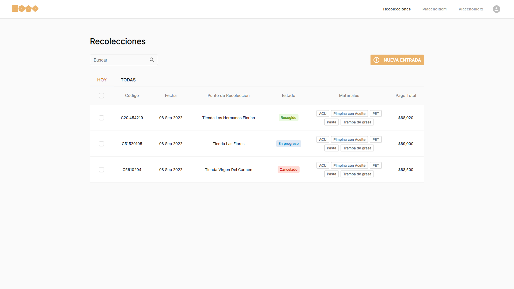

# Muta Demo

Este documento contiene la información necesaria para correr y navegar en el proyecto.

## Comandos

### `npm install`

Se instalarán todas las dependencias con este comando.

### `npm start`

Corre el proyecto de manera local en el puerto 3000. URL: http://localhost:3000

## Funcionalidades

### Vista Principal

Inicialmente se muestra una vista en la que se puede observar unas Tabs vacías ya que no ha sido agregada una nueva recolección. Al presionar el botón "NUEVA ENTRADA" se abrirá un Modal que contiene un formulario para el registro de una nueva recolección.
**Nota: Los items de la barra de navegación son estáticos. Tienen estilos aplicados.**

### Vista del Modal del Formulario de Nueva Recolección

Luego de presionar el botón "NUEVA ENTRADA" se mostrará el fomulario mencionado anteriormente como se puede observar en la imagen anterior. El botón de "CREAR REGISTRO" no será habilitado hasta que el formulario sea válido. Todos los campos son obligatorios. Los valores válidos son numéricos mayores que cero y con mínimo uno de los campos mayor que cero.

En caso de llenar el formulario incorrectamente, se mostrarán mensajes de error especificando en qué se equivocó el usuario al diligenciarlo como se puede ver en la captura anterior.

Una vez llenado el formulario de manera correcta, el botón "CREAR REGISTRO" será habilitado para realizar la creación de la nueva recolección.
**Nota: El Total a pagar se actualiza dependiendo a los datos ingresados por el usuario. Los valores de cada residuo son arbitrarios y se encuentran quemados en código para efectos de prueba.**

### Vista Principal con Recolecciones Creadas

Una vez creada la recolección, se mostratá una tabla que la contiene.

Así sería como se vería con más de una recolección creada. Se agregaron otros estados también arbitrarios quemados en el código para efectos de prueba.
**Nota: Las recolecciones creadas son almacenadas en las Cookies. Esto se hizo con el fin de almacenar las recolecciones creadas incluso después de recargar la página. Del mismo modo, se hizo uso de Cookies para efectos de prueba.**

### Vista del Detalle de las Recolecciones

Al presionar click en una de las recolecciones de la tabla, se mostrará el detalle de la recolección seleccionada.
**Nota: Se agregó un botón de eliminación en esta vista para remover las recolecciones que no se deseen.**
